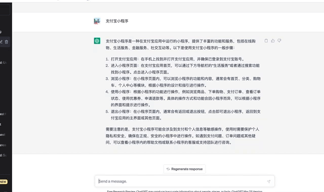

# awesome-scripts
油猴助手脚本合集(持续更新中) some awesome tempermonkey's script. 

> 由于脚本都是基于 Tempermonkey开发,,所以使用时前先安装 tempermonkey https://zhuanlan.zhihu.com/p/128453110


## 如何使用?
1. git clone https://github.com/atom-7/awesome-scripts.git 
2. 点击右上角浏览器油猴插件Icon 
3. 点击添加新脚本 (会出现编辑器)
4. 添加以下内容
```javascript
// ==UserScript==
// @name         GPT 重答助手
// @namespace    http://tampermonkey.net/
// @version      0.1
// @description  try to take over the world!
// @author       You
// @match        chat.openai.com/*
// @icon         https://www.google.com/s2/favicons?sz=64&domain=openai.com
// @grant        none
// @require      file:///Users/rick/awesome-scripts/gpt/index.js 
// 上面这行require的值替换成 file://git克隆时脚本实际的位置
// ==/UserScript==

(function() {
    'use strict';
    // 如果不知道如何 @require, 可以吧代码复制进这里
    // Your code here...
})();
```
5. 


## 脚本列表

### 1. GPT 重答助手
目录 gpt

效果 : 如果在提问的问题,因为切换ip或者时间过长,导致GPT的回答失败,接口返回403,则会自动记录本次提问的问题,自动刷新并且自动填写问题



